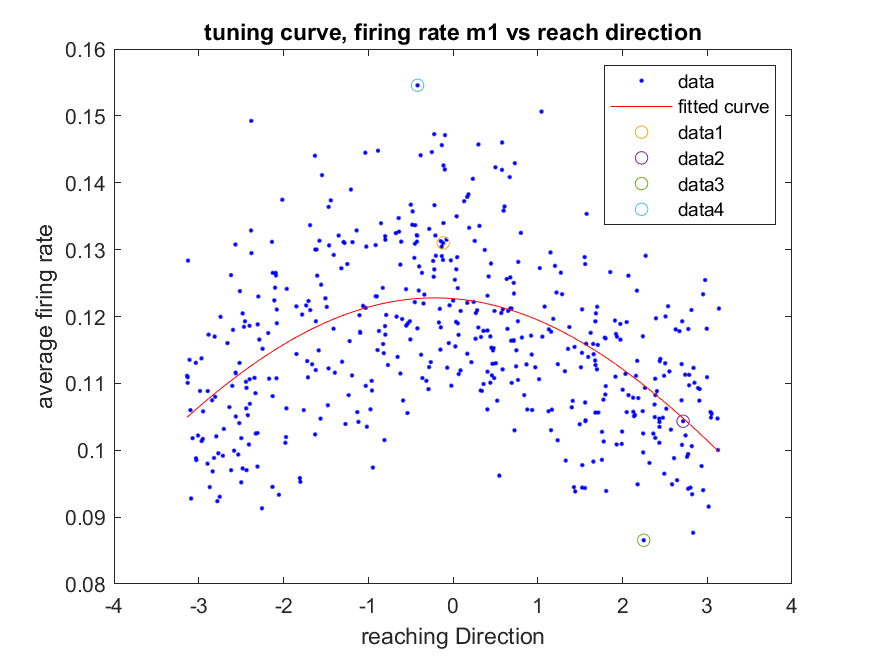
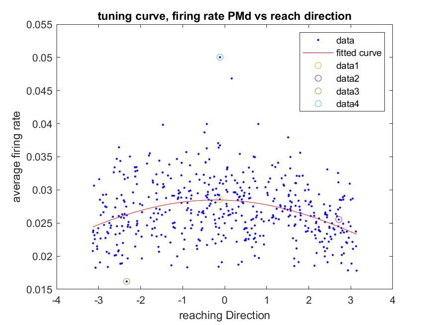
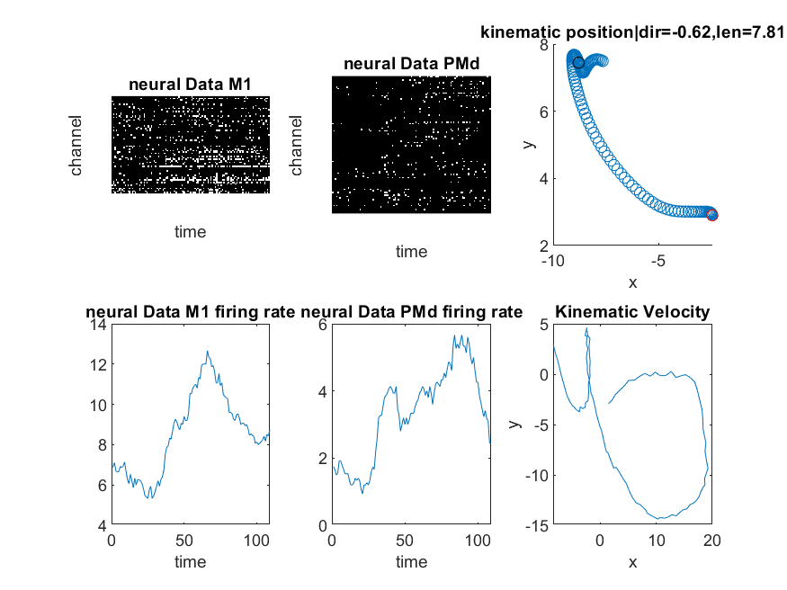

# Project-Computational-Neuroscience

## 1.Problem statement
Our goal is to find a relation between M1 (primary motor cortex) and mainly PMd (Pre motor cortex) of macaque monkey in a sequential reaching task.  
 
## 2.Related works
The following paper analyzes a subset of the data from these experiments:

Lawlor, P.N., Perich, M.G., Miller, L., Kording, K.P. Linear-Nonlinear-Time-Warp-Poisson models of neural activity.  J Comput Neurosci (2018). https://doi.org/10.1007/s10827-018-0696-6

Matthew G. Perich, Patrick N. Lawlor, Konrad P. Kording, Lee E. Miller (2018); Extracellular neural recordings from macaque primary and dorsal premotor motor cortex during a sequential reaching task. CRCNS.org.
http://dx.doi.org/10.6080/K0FT8J72

## 3.Proposed Method
We use tunning curve and fitting methods to fit a model (Gaussian model worked mostly here) to identify the relation between firing rate and the direction of moving hand. (relationship between neural data and behavior data)

## 4.Implementation

### 4.1. Dataset
Dataset was collected from https://crcns.org/data-sets/motor-cortex/pmd-1/

This data set includes extracellular recordings and behavior of macaque in experiments that examine the role of premotor cortex (PMd) and primary motor cortex (M1) in a sequential reaching task. In the experiment, the monkey controlled an on-screen cursor and was rewarded for moving that cursor to an indicated reach target, with multiple targets presented per trial. There were minimal kinematic requirements for the reaching movements (e.g., very brief hold times), meaning that the monkey typically made a relatively smooth series of reaches.  Behavioral variables recorded include position, velocity, and acceleration. Reach target locations and approximate presentation times are included. The electrophysiological recordings were collected with Utah multielectrode arrays from two monkeys, four sessions total.  There are tens of well-isolated units from both primary motor cortex (M1) and dorsal premotor cortex (PMd) for each session.  

### 4.2. Model
The gaussian model fits well on our data to show relation between firing rate and indicated reach target direction . also polynomial model can be used for the relation between firing rate and the distance between previous and next desired target location which resulted indignificant. also, Surprisingly the average speed of movement (Velocity) showed no significant relation with firing rate.

### 4.3. Evaluate
Statistical measurement can be applied to measure the significance of results.

